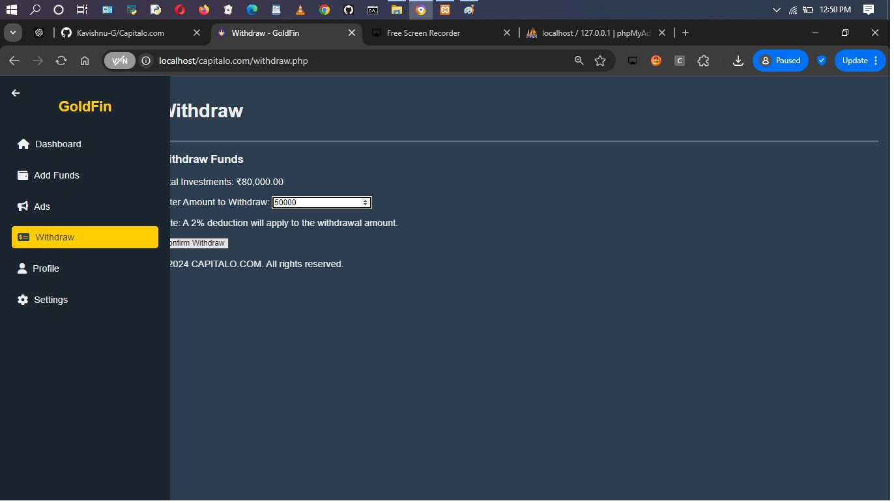

# 🏦 Gold Loan Investment App  

## 📖 Project Overview  
The **Gold Loan Investment App** bridges investors with borrowers seeking gold or silver-backed loans. Investors can post advertisements for their desired investment amount, which is pooled and lent out to borrowers at fixed interest rates. The app operates in tandem with offline lending operations, offering:  
- **2% Monthly Interest** for gold loans.  
- **3% Monthly Interest** for silver loans.  
- **1% Monthly Return** for investors on their invested amounts.  

## ✨ Core Features  
- **Ad Posting System:** Enables investors to post ads specifying their desired investment amount.  
- **Loan Allocation System:** Matches investment posts with borrowers and allocates funds accordingly.  
- **Interest Payout System:** Automates monthly interest payouts to investors.  
- **Collateral Monitoring:** Tracks gold and silver collateral to ensure security.  
- **Loan Monitoring and Repayment:** Ensures timely repayment collection and updates investors.  
- **Investor Dashboard:** Real-time updates on investment status, interest earned, and loan details.  
- **Risk Management Features:** Options for investor insurance and other risk reduction methods.  

## 📋 Business and Regulatory Requirements  
The project adheres to legal and financial regulations for safe and transparent operations:  

### 1. Business Registration  
- Register as a legal entity (LLC, Corporation, LLP).  
- Protect the brand by registering the trade name.  

### 2. Financial Services and Lending Licenses  
- **NBFC License (India):** To operate as a lending company regulated by RBI.  
- **Money Lending License:** Compliance in regions requiring this license.  
- **Peer-to-Peer Lending License:** For pooling investor funds.  

### 3. Investment and Securities Compliance  
- **Securities Registration:** For investor protection.  
- **AML/KYC Compliance:** Ensures Anti-Money Laundering and identity verification.  

### 4. Collateral and Valuation Compliance  
- **Gold Loan Licensing:** Adheres to gold and silver collateral regulations.  
- **Pawn/Collateral Loan License:** For collateral-backed lending compliance.  

### 5. Data Privacy and Security Compliance  
- **Data Protection Regulations:** Compliance with GDPR, CCPA, etc.  
- **Cybersecurity Standards:** Implements ISO/IEC 27001 protocols.  

### 6. Local Tax Compliance  
- Proper tax reporting and registration.  

### 7. App Store Compliance  
- Adheres to Google Play and Apple App Store policies.  

## 💻 Technology Stack  
- **Frontend:** Flutter for cross-platform mobile app development.  
- **Backend:** PHP, MySQL, Firebase for data management and user authentication.  
- **Security:** Blockchain or secure ledger integration for transaction transparency.  
- **Payment Gateway:** Secure payment integration.  

## 📅 Project Timeline  
- **Stage 1:** Market Research and Compliance Assessment (1 Month)  
- **Stage 2:** App Design and Prototyping (2 Months)  
- **Stage 3:** Core Development - Frontend and Backend (4 Months)  
- **Stage 4:** Compliance Review and Testing (2 Months)  
- **Stage 5:** Beta Launch and Feedback Collection (1 Month)  
- **Stage 6:** Full Launch and Continuous Updates  

## 🔄 Project Status  
- ✅ **User Panel:** Fully Completed  
- 🚧 **Merchant Panel:** Development in Progress  
  - Dashboard: Displays total loan claimed and recent transactions.  
  - Ad Management: List of ads created by users with usernames.  
  - More features coming soon!  

## 📊 Future Enhancements  
- Advanced security features, including multi-factor authentication.  
- Notifications for transactions and profile updates.  
- Integration with third-party payment gateways.  
- Enhanced risk management for investor protection.  

## 🖼️ Screenshots

### User Dashboard

## 🌟 How to Run the Project  
1. Clone the repository to your local machine.  
2. Start your local server (e.g., XAMPP, WAMP).  
3. Create a database named `gold_loan_app`.  
4. Import the provided SQL file (`gold_loan_app.sql`) into the database.  
5. Place the project files in the server directory (e.g., `htdocs`).  
6. Access the project via `http://localhost/gold-loan-app`.  

### 👥 Login Credentials  
#### Sample Merchant User:  
- Username: `mer`  
- Password: `mr`  

## 🤝 Contributing  
Contributions are welcome! Feel free to fork the repository, submit pull requests, or report issues.  

## ❤️ Thank You!  
Thank you for exploring our project! Stay tuned as we build a robust system to simplify gold loan investments. 🚀  
